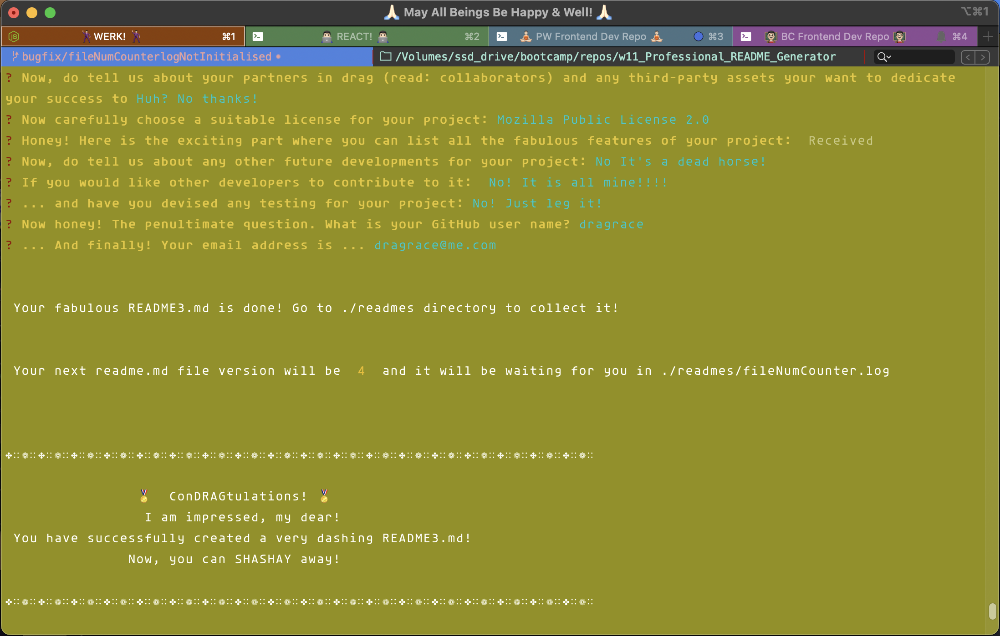
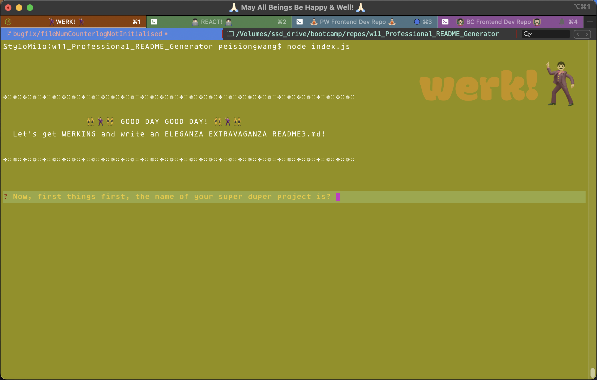

# w11_Professional_README_Generator

## Description

This project is part of the Frontend Dev Boot Camp course challenge for the eleventh week "Working with ES6 and Node.js". 

It requires us to use the node.js inquirer package and ES6 to dynamically create a command-line README.md generator application that produces a high quality professional README.md. 

The dynamically generated README.md will be stored in a separate directory (./readmes) and each time a user generates a README.md, the file name will have a version number added to it. 

As this command line application won't be deployed, I have provided a link to a walkthrough video that will demonstrates its functionalities by simply invoking the following command:

```
   node index.js
```   

I have modified the provided starter code to create this command line application. 

***NOTE: I have attempted to lighten the mood of the inquirer prompt questions using references from the "Ru Paul Drag Race" TV series.***


### Methodology: Pseudo Code
* Prepare a template of a high quality and professional README.md 
  * to be used as prompts and 
  * to identify the formatting and user input validations needed
    * email address
    * empty text input for required README.md sections
    * replace empty text input with "N.A." for optional README.md sections
* Prepare the list of possible licenses and the accompanying images in .md stylings. 
* Prepare the questions array for feeding into the inquirer prompts
* Prepare a function to generate the markdown text string
  * may need constants to hold standard text strings that are not dynamically generated e.g. Table of Contents
  * may need several functions to collect user inputs, format them for rendering before addint to the generate function. e.g. multiple screen dump links
* create a separate dir to hold the dynamically generated README.md so that the README.md for this github repo will not be overwritten.
  * add file version counter (using a log file) to hold next file version number.


## User Story

AS A developer

I WANT a README generator

SO THAT I can quickly create a professional README for a new project.


[Video Demo (1mins 48 secs) Screencastify recording on GDrive](https://drive.google.com/file/d/1pnsSzucfp3dzeHRfz8HlK0grMkRM-PMN/view?usp=sharing) or click on the embeded video below:


https://user-images.githubusercontent.com/119045159/221850720-6731e924-cc71-4e10-9394-21b7b1cff7cf.mp4


## Acceptance Criteria

* Create a command-line application that accepts user input.
* When a user is prompted for information about the application repository, a high-quality, professional README.md is generated with:
  * The title of my project
  * Sections entitled:
    * Description
    * Table of Contents
    * Installation
    * Usage
    * License
    * Contributing
    * Tests
    * Questions
* When a user enters the project title, it's displayed as the title of the README.
* When a user enters a description, installation instructions, usage information, contribution guidelines, and test instructions, this information is added to the sections of the README entitled Description, Installation, Usage, Contributing, and Tests.
* When a user chooses a license for their application from a list of options, a badge for that license is added near the top of the README and a notice is added to the section of the README entitled License that explains which license the application is covered under.
* When a user enters their GitHub username, it's added to the section of the README entitled Questions, with a link to their GitHub profile.
* When a user enters their email address, it's added to the section of the README entitled Questions, with instructions on how to reach them with additional questions.
* When a user clicks on the links in the Table of Contents, they are taken to the corresponding section of the README.
* The .gitignore file should specifically include node_modules/ and .DS_Store/ (as I am using a mac laptop).
* The github repo includes a package .JSON with the required dependencies.


## Table of Contents (Optional)

* [Installation](#installation)
* [Usage](#usage)
* [Credits](#credits)
* [License](#license)
* [Features](#features)
* [Testing](#testing)
* [Contribution](#contribution)


## Installation

* This command line app can be packaged as an npm package at a later stage.


## Usage 

### Video Demo:

[Video Demo (1mins 48 secs) Screencastify recording on GDrive](https://drive.google.com/file/d/1pnsSzucfp3dzeHRfz8HlK0grMkRM-PMN/view?usp=sharing)


### Sample README2.md generated by the above mentioned demo video: 

*(please note that the images path/name used in the demo video are fictitious and so will not be shown in this sample README.md)*: 


[Click to see Sample README.md](readmes/README2.md)


### Screen dumps of the command line application:






## Credits

* list of licenses and their corresponding logos by [lukas-h/license-badges.md](https://gist.github.com/lukas-h/2a5d00690736b4c3a7ba)
* email validator [https://www.npmjs.com/package/email-validator](https://www.npmjs.com/package/email-validator)
* [Professional Readme Guide](https://coding-boot-camp.github.io/full-stack/github/professional-readme-guide)


## License 

MIT License [](https://opensource.org/licenses/MIT)


## Features

### Main Features
* At command prompt, a user can activate this command line application (after installing node and inquirer npm) by invoking

```
   node index.js
```   

* The user will see a welcome message
* The user will be prompted to answer questions either by a single line input, or enter the default vi editor to input longer paragraphs or to chose from a list of options.
* In the case of screen dump(s), the user is asked to input the first screen dump and the user can select to include one or 2 more screen dumps (total of 3) or no more screen dumps.
  * When the user chooses no more screen dump, then the user will be see the prompt for the second and third screen dump details.
  * When the user chooses one more screen dump, then the user will be see the prompt for the second screen dump details.  
  * When the user chooses two more screen dump, then the user will be see the prompt for the second and third screen dump details.    
* The following user input validation will apply:
    * When the user chooses no more screen dump, then the user will be see the prompt for the second and third screen dump.
    * email address
    * for Credits to collaborators, project future directions, future contributions by other developers and testing sections, if the user chooses not to add any sections, the text "N.A." is added to the respective sections.
* For the Question section, the user is prompted to input their Github user name and their email address.
  * email inputwill be validated.
* When the full list of prompts have been completed, the user is shown 
  * a congratulatory success message,
  * the name of the README<version number>.md
  * the directory where the README is stored.

  
  
### Future Developments
* Allow user to reset the file versioning counter
* Allow user to delete any or specific previously generated readme files 
* Allow user to create their own output directory for the generated README.md files
* More detail user input validation on:
  * user email input
  * user GitHub profile using the GitHub API [https://api.github.com/users/{username}](https://api.github.com)
* Implement auto-complete for the license list selection
* Checks for vulgarity
* Automate file path selection for images.
* Check for / Create the readmes dir and file version number log file on first install.


## Testing
* This application has been tested on iTerm and Terminal app on MacOS Ventura 13.2.1 only.


## Contribution
* If you would like to contribute to this application, please contact me via
  * GitHub [https://github.com/HaveTimeDrinkTea/w11_Professional_README_Generator](https://github.com/HaveTimeDrinkTea/w11_Professional_README_Generator)
  * email to <havetimedrinktea@gmail.com>


